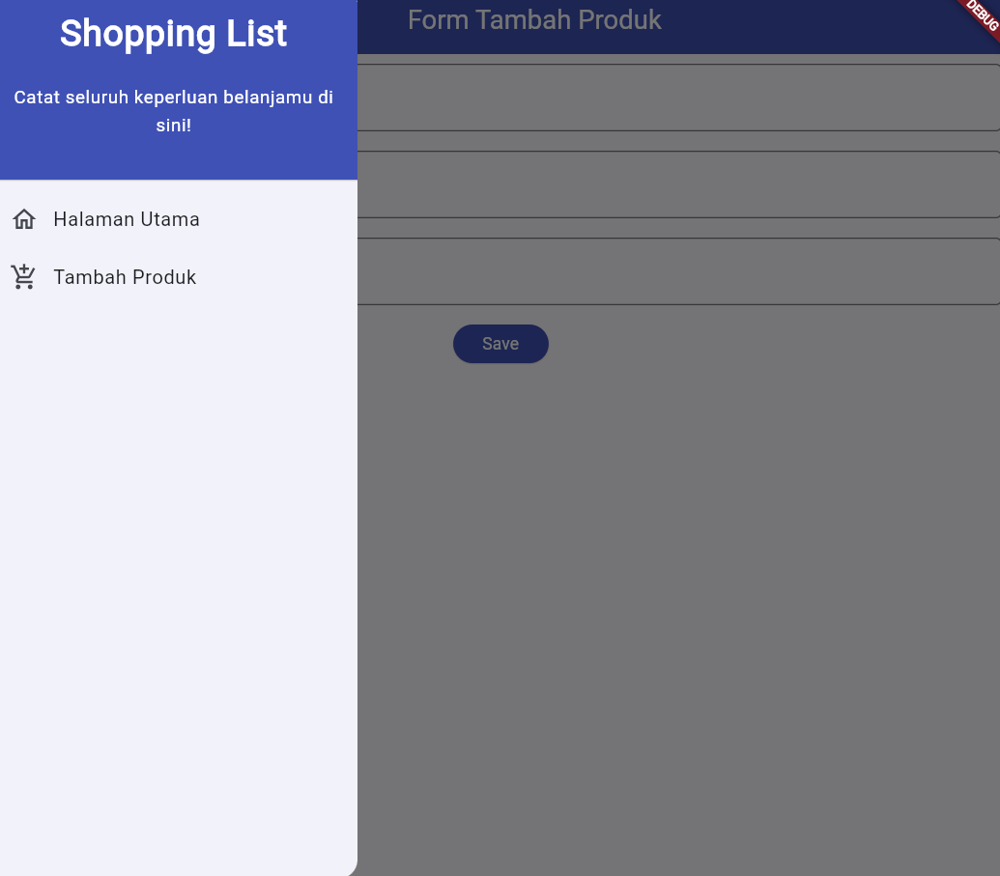

<a name="readme-top"></a>

<br />
<div align="center">
  <a href="http://samuel-taniel-tugas.pbp.cs.ui.ac.id">
    
  </a>

<h3 align="center">HAE Roblox UGC Store</h3>

  <p align="center">
    Aplikasi Store HAE Roblox UGC
    <br />
    <a href="https://github.com/SamuelTanielM/pokemon-shop"><strong>Explore the code »</strong></a>
    <br />
    <br />
    <a href="http://samuel-taniel-tugas.pbp.cs.ui.ac.id">View Site</a>
    ·
    <a href="https://pbp-fasilkom-ui.github.io/ganjil-2024/assignments/individual/assignment-2">View Assignment</a>
  </p>
</div>


🏪 HAE Roblox UGC Store merupakan laman dimaana pengguna bisa membeli aksesoris Roblox dan menjual aksesoris Roblox. Lamannya masih dalam tahap pengerjaan,
Tetapi Anda masih dapat menikmati aksesoris UGC Roblox yang keren! ✨
<details>
  <summary>Daftar Tugas</summary>
  <ol>
      <details>
      <summary><a href="#tugas-7">Tugas 7 | 🎴 Elemen Dasar Flutter</a></summary>
        
<hr>
<hr>
<!-- #TODO:>>>:TODO:>>>:TODO:>>>:TODO:>>>:TODO:>>>:TODO:>>>:TODO:>>>:TODO:>>>:TODO:>>>:TODO:>>>:TODO:>>>:TODO:>>>:TODO:>>>:TODO:>>>:TODO:>>>:TODO:>>>:TODO:>>>:TODO:>>>:TODO:>>>:TODO:>>>:TODO:>>>:TODO:>>>:TODO:>>>:TODO:>>>:TODO:>>>:TODO:>>>:TODO:>>>:TODO:>>>:TODO:>>>:TODO:>>>:TODO:>>>: TABLE OF CONTENTS -->
<h3 align="center">Tugas 7: Elemen Dasar Flutter</h3>

<a name="tugas-7"></a>
<details>
<summary>Table of Contents</summary>
<ol>
  <li>
    <a href="#perbedaan-stateless">perbedaan utama antara stateless dan stateful widget dalam konteks pengembangan aplikasi Flutter</a>
  </li>
  <li>
    <a href="#widget-digunakan">widget yang digunakan untuk menyelesaikan tugas ini dan jelaskan fungsinya masing-masing.</a>
  </li>
  <li>
    <a href="#checklist7">implementasi checklist</a>
  </li>
</ol>
</details>


<!-- ABOUT THE PROJECT -->
<a name="perbedaan-stateless"></a>
## Perbedaan Stateless dan Stateful Widget

<strong>Stateless widget:</strong>
<p>Stateless widget adalah widget yang tidak dapat berubah (immutable) setelah dibuat. Artinya, setiap kali ada perubahan pada widget tersebut, widget akan dibuat ulang sepenuhnya.
Stateless widget tidak menyimpan status (state) internal, sehingga tidak dapat mempengaruhi tampilan atau perilaku aplikasi secara langsung.
Stateless widget cocok digunakan untuk bagian tampilan yang statis atau tidak berubah, seperti gambar, teks, atau ikon.
</p>
<p><br></p>
<strong>Stateful widget:</strong>
<p></p>
<p>Stateful widget adalah widget yang dapat berubah (mutable) dan menyimpan status (state) internal.
Stateful widget memiliki kemampuan untuk memperbarui tampilan atau perilaku aplikasi ketika ada perubahan pada status internalnya.
Dalam stateful widget, status internal dapat diperbarui dengan menggunakan setState() yang akan memicu pembaruan tampilan.
Stateful widget cocok digunakan untuk bagian tampilan atau perilaku yang memerlukan interaksi pengguna, seperti formulir, tombol, atau animasi.</p>
<p><br></p>
<strong>referensi:</strong> https://rlogicaltech.medium.com/what-is-a-stateless-and-stateful-widget-in-a-flutter-5b9ef647658c

<p align="right">(<a href="#readme-top">back to top</a>)</p>

<hr>

<a name="widget-digunakan"></a>
### Widget pada App dan Fungsinya

MaterialApp: Widget ini digunakan untuk mengkonfigurasi dan mengatur tema dari aplikasi Flutter. Pada kode saya, widget ini digunakan untuk mengatur judul dan tema aplikasi

<a style = "Color: pink">Scaffold</a>: Sebagai kerangka dasar aplikasi, yang berisi struktur umum seperti AppBar, body, dan lain-lain.

<a style = "Color: pink">AppBar</a>: digunakan untuk menampilkan AppBar di bagian atas aplikasi dan menampilkan judul aplikasi.

<a style = "Color: pink">SingleChildScrollView</a>: pembungkus (wrapper) yang membuat konten di dalamnya untuk discroll secara vertikal. Digunakan untuk membungkus seluruh isi halaman.

<a style = "Color: pink">Padding</a>: Memberikan padding atau jarak di sekeliling konten yang ada di dalamnya.

<a style = "Color: pink">Column</a>: menampilkan children secara vertikal

<a style = "Color: pink">Text</a>: menampilkan teks. Contoh pada kode menampilkan judul "HAE UGC Catalog"

<a style = "Color: pink">GridView.count</a>: untuk menampilkan child widget secara grid dengan jumlah kolom yang ditentukan.

<a style = "Color: pink">Container</a>: wadah untuk menyimpan widget lain, contoh pada kode menyimpan Icon dan Text pada setiap card.

<a style = "Color: pink">InkWell</a>: membuat area responsif terhadap sentuhan pengguna. Contoh untuk card agar dapat di-tap.

<a style = "Color: pink">Icon</a>: menampilkan ikon

<a style = "Color: pink">SnackBar</a>: menampilkan pesan sementara (snack bar) yang muncul di bagian bawah layar.


<p align="right">(<a href="#readme-top">back to top</a>)</p>

<hr>

<a name="checklist7"></a>
### Checklist Tugas 7
<div align="center">
<a href="http://samuel-taniel-tugas.pbp.cs.ui.ac.id">
  
</a>
</div>

- [X] Membuat sebuah program Flutter baru dengan tema inventory seperti tugas-tugas sebelumnya.

Pertama yang saya lakukan yaitu membuat flutter appnya terlebih dahulu dengan menjalankan ```flutter create Roblox_UGC```

Pada file main.dart, kita mendefinisikan MyApp yang merupakan stateless widget. Di dalam build() method, kita mengembalikan MaterialApp sebagai root dari aplikasi kita. Di dalam MaterialApp, kita memberikan judul aplikasi dan mengatur tema dengan menggunakan ColorScheme.
```
import 'package:flutter/material.dart';
import 'package:roblox_ugc/menu.dart';

void main() {
  runApp(const MyApp());
}

class MyApp extends StatelessWidget {
  const MyApp({super.key});

  // This widget is the root of your application.
  @override
  Widget build(BuildContext context) {
    return MaterialApp(
      title: 'Roblox UGC Store',
      theme: ThemeData(

        colorScheme: ColorScheme.fromSeed(seedColor: Color.fromARGB(255, 199, 201, 211)),
        useMaterial3: true,
      ),
      home: MyHomePage(),
    );
  }
}
```

Pada file menu.dart, kita mendefinisikan MyHomePage yang juga merupakan stateless widget. Di dalam build() method, kita mengembalikan Scaffold sebagai tampilan halaman utama aplikasi.
```
  @override
    Widget build(BuildContext context) {
        return Scaffold(
          
          appBar: AppBar(
            title: const Text(
              'Roblox UGC Shop',
            ),
          ),
          body: SingleChildScrollView(
            // Widget wrapper yang dapat discroll
            child: Padding(
              padding: const EdgeInsets.all(10.0), // Set padding dari halaman
              child: Column(
                // Widget untuk menampilkan children secara vertikal
                children: <Widget>[
                  const Padding(
                    padding: EdgeInsets.only(top: 10.0, bottom: 10.0),
                    // Widget Text untuk menampilkan tulisan dengan alignment center dan style yang sesuai
                    child: Text(
                      'HAE UGC Catalog', // Text yang menandakan toko
                      textAlign: TextAlign.center,
                      style: TextStyle(
                        fontSize: 30,
                        fontWeight: FontWeight.bold,
                      ),
                    ),
                  ),
                  // Grid layout
                  GridView.count(
                    // Container pada card kita.
                    primary: true,
                    padding: const EdgeInsets.all(20),
                    crossAxisSpacing: 10,
                    mainAxisSpacing: 10,
                    crossAxisCount: 3,
                    shrinkWrap: true,
                    children: items.map((ShopItem item) {
                      // Iterasi untuk setiap item
                      return ShopCard(item);
                    }).toList(),
                  ),
                ],
              ),
            ),
          ),
        );
    }
```


- [X] Membuat tiga tombol sederhana dengan ikon dan teks untuk:
 > Melihat daftar item (Lihat Item)
 > Menambah item (Tambah Item)
 > Logout (Logout)

 Pertama kita buat dulu item untuk ikon dan teks tersebut, 
 ```
 final List<ShopItem> items = [
    ShopItem("Lihat Produk", Icons.checklist, Color.fromARGB(255, 91, 104, 176),),
    ShopItem("Tambah Produk", Icons.add_shopping_cart, Color.fromARGB(255, 119, 125, 158),),
    ShopItem("Logout", Icons.logout, Color.fromARGB(255, 119, 125, 158),),
  ];
  
  ```

  berdasarkan definis ShopItem dan ShopCard
  Shop Item:
  ```
  class ShopItem {
  final String name;
  final IconData icon;
  final Color warna;

  ShopItem(this.name, this.icon, this.warna);
}
```

- [X] Memunculkan Snackbar dengan tulisan:
 > "Kamu telah menekan tombol Lihat Item" ketika tombol Lihat Item ditekan.
 > "Kamu telah menekan tombol Tambah Item" ketika tombol Tambah Item ditekan.
 > "Kamu telah menekan tombol Logout" ketika tombol Logout ditekan.

dan ShopCard yaitu untuk menciptakan button yang ketika ditekan akan memunculkan SnackBar dengan showSnackBar dan menghandle jika ada snackbar lain dengan hideCurrentSnackBar(). Disini kita menggunakan padding untuk buttonnya dan isi dari button tersebut adalah icon dan teksnya, warna dari button dari ShopItem masing-masing. 

ShopCard tidak memerlukan state internal karena hanya memperlihatkan informasi yang diberikan melalui konstruktor (ShopItem item). Widget ini hanya memperlihatkan item toko dengan ikon dan teks yang diterima melalui konstruktor, dan menampilkan pesan SnackBar saat di-tap. Sehingga performanya lebih baik

```

class ShopCard extends StatelessWidget {
  final ShopItem item;

  const ShopCard(this.item, {super.key}); // Constructor

  @override
  Widget build(BuildContext context) {
    return Material(
      color: item.warna,
      child: InkWell(
        // Area responsive terhadap sentuhan
        onTap: () {
          // Memunculkan SnackBar ketika diklik
          ScaffoldMessenger.of(context)
            ..hideCurrentSnackBar()
            ..showSnackBar(SnackBar(
                content: Text("Kamu telah menekan tombol ${item.name}!")));
        },
        child: Container(
          // Container untuk menyimpan Icon dan Text
          padding: const EdgeInsets.all(8),
          child: Center(
            child: Column(
              mainAxisAlignment: MainAxisAlignment.center,
              children: [
                Icon(
                  item.icon,
                  color: Colors.white,
                  size: 30.0,
                ),
                const Padding(padding: EdgeInsets.all(3)),
                Text(
                  item.name,
                  textAlign: TextAlign.center,
                  style: const TextStyle(color: Colors.white),
                ),
              ],
            ),
          ),
        ),
      ),
    );
  }
}
```


Kemudian dimunculkan pada widget Build dengan iterasi setiap items nya pada children. 

```
children: items.map((ShopItem item) {
                      // Iterasi untuk setiap item
                      return ShopCard(item);
                    }).toList(),
```


<p align="right">(<a href="#readme-top">back to top</a>)</p>

<hr>
<hr>
      </details>
      <details>
      <summary><a href="#tugas-2">Tugas 8 | ✅ Flutter Navigation, Layouts, Forms, and Input Elements</a></summary>


<hr>
<hr>
<!-- #TODO:>>>:TODO:>>>:TODO:>>>:TODO:>>>:TODO:>>>:TODO:>>>:TODO:>>>:TODO:>>>:TODO:>>>:TODO:>>>:TODO:>>>:TODO:>>>:TODO:>>>:TODO:>>>:TODO:>>>:TODO:>>>:TODO:>>>:TODO:>>>:TODO:>>>:TODO:>>>:TODO:>>>:TODO:>>>:TODO:>>>:TODO:>>>:TODO:>>>:TODO:>>>:TODO:>>>:TODO:>>>:TODO:>>>:TODO:>>>:TODO:>>>: TABLE OF CONTENTS -->
<h3 align="center">Tugas 8: Flutter Navigation, Layouts, Forms, and Input Elements</h3>   

<a name="tugas-8"></a>
<details>
<summary>Table of Contents</summary>
<ol>
  <li>
    <a href="#perbedaan-navigator">perbedaan antara Navigator.push() dan Navigator.pushReplacement() dan contoh</a>
  </li>
  <li>
    <a href="#layout-widget">layout widget pada Flutter dan konteks penggunaan</a>
  </li>
  <li>
    <a href="#elemen-form">elemen input pada form dan mengapa</a>
  </li>
  <li>
    <a href="#clean-architecture">clean architecture pada flutter</a>
  </li>
  <li>
    <a href="#checklist8">implementasi checklist</a>
  </li>
</ol>
</details>


<!-- ABOUT THE PROJECT -->
<a name="perbedaan-navigator"></a>
## Perbedaan Navigator.push() dan Navigator.pushReplacement() dan contoh

<Strong>Navigator.push() dan Navigator.pushReplacement()</Strong> adalah dua metode yang digunakan dalam Flutter untuk menavigasi antara layar atau halaman (screens) dalam aplikasi.

<Strong>Navigator.push():</Strong>
Metode ini digunakan untuk menambahkan layar baru ke tumpukan navigasi. Artinya, layar baru ditambahkan di atas layar yang sudah ada. Seperti stack.
Contoh
```
if (item.name == "Tambah Produk") {
            // NOTE: Gunakan Navigator.push untuk melakukan navigasi ke MaterialPageRoute yang mencakup ShopFormPage.
            Navigator.push(context,
                    MaterialPageRoute(builder: (context) => const ShopFormPage()));
            }
```

<Strong>Navigator.pushReplacement():</Strong>
Metode ini digunakan untuk menambahkan layar baru ke tumpukan navigasi dan menggantikan layar yang sudah ada dengan layar baru. Ini berguna jika Anda ingin mengganti layar saat ini dengan layar baru dan menghapus layar sebelumnya dari tumpukan.
Contoh
```
onTap: () {
              Navigator.pushReplacement(
                  context,
                  MaterialPageRoute(
                    builder: (context) => MyHomePage(),
                  ));
            },
```


<p align="right">(<a href="#readme-top">back to top</a>)</p>

<hr>

<a name="layout-widget"></a>
### layout widget pada Flutter dan konteks penggunaan

- [X] Container

widget dasar yang dapat mengandung widget lain dan menyediakan kontrol yang luas terhadap dekorasi, padding, margin, dan transformasi.

Contoh konteksnya adalah ketika kita ingin mengelilingi widget lain untuk memberikan properti padding, margin, atau dekorasi tertentu.

```
Container(
  padding: EdgeInsets.all(16.0),
  margin: EdgeInsets.symmetric(vertical: 8.0),
  decoration: BoxDecoration(
    color: Colors.blue,
    borderRadius: BorderRadius.circular(8.0),
  ),
  child: Text('Hello, Flutter!'),
)
```

- [X] Row dan Column

digunakan untuk mengatur widget secara horizontal (Row) atau vertikal (Column).
konteks penggunaan ketika membuat susunan widget dalam satu baris atau satu kolom.

```
Row(
  children: <Widget>[
    Icon(Icons.star),
    Text('Star'),
  ],
)
```

- [X] ListView

menyusun widget secara berurutan dalam satu arah (umumnya vertikal) dan memungkinkan scrolling.

konteks penggunaan: Menampilkan daftar item atau tampilan yang dapat di-scroll.

```
ListView(
  children: <Widget>[
    ListTile(
      leading: Icon(Icons.book),
      title: Text('Book'),
    ),
    ListTile(
      leading: Icon(Icons.music_note),
      title: Text('Music'),
    ),
  ],
)
```


- [X] GridView

menyusun widget dalam bentuk grid, memungkinkan untuk tata letak dua dimensi.
konteks penggunaan Menampilkan data dalam grid.

```
GridView.count(
  crossAxisCount: 2,
  children: <Widget>[
    // Children widgets...
  ],
)
```

- [X] Stack

Stack memungkinkan penumpukan widget, yang artinya beberapa widget dapat berada di atas widget lain.

Konteks Penggunaan: Membuat tata letak overlay atau menumpuk elemen.
```
Stack(
  children: <Widget>[
    Image.network('https://example.com/image.jpg'),
    Positioned(
      bottom: 10.0,
      right: 10.0,
      child: Text('Overlay Text'),
    ),
  ],
)
```

- [X] Expanded dan Flexible

digunakan untuk mengontrol sejauh mana widget dapat berkembang dalam parent widget yang memiliki ukuran terbatas.

Konteks Penggunaan: Membuat widget dapat memanfaatkan ruang yang tersedia.
```
Column(
  children: <Widget>[
    Text('Fixed Height'),
    Expanded(
      child: Container(
        color: Colors.blue,
      ),
    ),
  ],
)
```


- [X] SizedBox
memberikan batas atau dimensi tetap pada widget di dalamnya.

konteks penggunaan: Menentukan dimensi tetap untuk widget.
```
SizedBox(
  width: 100.0,
  height: 50.0,
  child: SomeWidget(),
)
```

<p align="right">(<a href="#readme-top">back to top</a>)</p>

<hr>
<a name="elemen-form"></a>
### elemen input pada form dan mengapa

Pada kode tugas ini diggunakan elemen input TextFormField pada form

Hal ini karena input akan digunakan untuk mengambil nama produk, harga produk, dan deskripsi dari pengguna. TextFormField juga dapat diatur sedemikian rupa dengan inputDecorationnya dan validasi yang sudah tersedia dengan menggunakan onChanged untuk menyimpan nilai input ke dalam variabel _name, _price, dan _deskripsi. Validasi dilakukan untuk memastikan input tidak kosong.

Contoh TextFormField untuk name, tinggal dikonfigurasi untuk price dan deskripsi:
```
body: Form(
          key: _formKey,
          child: SingleChildScrollView(
            child: Column(
              crossAxisAlignment: CrossAxisAlignment.start,
              children: [
                Padding(
                  padding: const EdgeInsets.all(8.0),
                  child: TextFormField(
                    decoration: InputDecoration(
                      hintText: "Nama Produk",
                      labelText: "Nama Produk",
                      border: OutlineInputBorder(
                        borderRadius: BorderRadius.circular(5.0),
                      ),
                    ),
                    onChanged: (String? value) {
                      setState(() {
                        _name = value!;
                      });
                    },
                    validator: (String? value) {
                      if (value == null || value.isEmpty) {
                        return "Nama tidak boleh kosong!";
                      }
                      return null;
                    },
                  ),
                ),
```

<p align="right">(<a href="#readme-top">back to top</a>)</p>

<hr>
<a name="clean-architecture"></a>

### Clean architecture pada flutter

Penerapan Clean Architecture pada aplikasi Flutter melibatkan pengorganisasian kode dan struktur proyek agar menjadi lebih terpisah dan mudah diuji. Clean Architecture adalah konsep pengembangan perangkat lunak yang memisahkan komponen-komponen utama aplikasi ke dalam beberapa lapisan terpisah. Ada beberapa prinsip dan komponen utama dalam Clean Architecture, dan berikut adalah cara penerapannya dalam konteks Flutter pada tugas ini:

=== Screens
- menu.dart
- shoplist_form.dart

=== widgets
- left_drawer.dart
- shop_card.dart

= main.dart

yang menunjukkan pemisahan komponen seperti tampilan interface dan widgetsnya.

Sehingga dengan clean architecture, aplikasi akan lebih modular, mudah diuji, dan lebih mudah untuk dipelihara. Setiap bagian bertanggung jawab atas tugas tertentu, dan hubungan antar lapisan dibangun dengan cara yang menjaga arus kontrol dan ketergantungan.

reference: https://blog.cleancoder.com/uncle-bob/2012/08/13/the-clean-architecture.html


<p align="right">(<a href="#readme-top">back to top</a>)</p>

<hr>

<a name="checklist8"></a>
### Checklist Tugas 8
<div align="center">
<a href="http://samuel-taniel-tugas.pbp.cs.ui.ac.id">
  
</a>
</div>

- [X] Membuat minimal satu halaman baru pada aplikasi, yaitu halaman formulir tambah item baru dengan ketentuan sebagai berikut:
 - Memakai minimal tiga elemen input, yaitu name, amount, description. Tambahkan elemen input sesuai dengan model pada aplikasi tugas Django yang telah kamu buat.
 Pada kode ini dibuat objek name price dan description yang akan diappend data dari input dengan contoh pada name
```
class _ShopFormPageState extends State<ShopFormPage> {
    // ignore: no_leading_underscores_for_local_identifiers
    final _formKey = GlobalKey<FormState>();
    // ignore: no_leading_underscores_for_local_identifiers
    String _name = "";
    // ignore: no_leading_underscores_for_local_identifiers
    int _price = 0;
    // ignore: no_leading_underscores_for_local_identifiers
    String _description = "";
    
    @override
    Widget build(BuildContext context) {

        return Scaffold(
          appBar: AppBar(
            title: const Center(
              child: Text(
                'Form Tambah Produk',
              ),
```
 - Memiliki sebuah tombol Save.
 - Setiap elemen input di formulir juga harus divalidasi dengan ketentuan sebagai berikut:
 - Setiap elemen input tidak boleh kosong.
 - Setiap elemen input harus berisi data dengan tipe data atribut modelnya.

Menggunakan body Form yang akan menerima _formKey sehingga form dapat divalidasi dan di reset. Selain itu juga, elemen input pada form divalidasi dengan validator jika bukan string atau kosong maka akan mengeluarkan output tertentu. Elemen input juga berisi data dengan tipe data atribut modelnya  yaitu String pada variabel dan pada form menerima String pada validator, sementara untuk price akan di parse integer dan diset ketika onChanged ke _name atau _price. Contoh pada input untuk name:
```

        body: Form(
          key: _formKey,
          child: SingleChildScrollView(
            child: Column(
              crossAxisAlignment: CrossAxisAlignment.start,
              children: [
                Padding(
                  padding: const EdgeInsets.all(8.0),
                  child: TextFormField(
                    decoration: InputDecoration(
                      hintText: "Nama Produk",
                      labelText: "Nama Produk",
                      border: OutlineInputBorder(
                        borderRadius: BorderRadius.circular(5.0),
                      ),
                    ),
                    onChanged: (String? value) {
                      setState(() {
                        _name = value!;
                      });
                    },
                    validator: (String? value) {
                      if (value == null || value.isEmpty) {
                        return "Nama tidak boleh kosong!";
                      }
                      return null;
                    },
                  ),
                ),
```
 
- [X] Mengarahkan pengguna ke halaman form tambah item baru ketika menekan tombol Tambah Item pada halaman utama.

dengan menggunakan navigator push maka page akan dimasukkan dalam stack routing dengan MaterialPageRoute yang akan memunculkan tampilan shopformpage di file shoplist_form dengan import pada menu.dart.
```
Widget build(BuildContext context) {
    return Material(
      color: item.warna,
      child: InkWell(
        // Area responsive terhadap sentuhan
        onTap: () {
          // Memunculkan SnackBar ketika diklik
          ScaffoldMessenger.of(context)
            ..hideCurrentSnackBar()
            ..showSnackBar(SnackBar(
                content: Text("Kamu telah menekan tombol ${item.name}!")));

            if (item.name == "Tambah Produk") {
            // NOTE: Gunakan Navigator.push untuk melakukan navigasi ke MaterialPageRoute yang mencakup ShopFormPage.
            Navigator.push(context,
                    MaterialPageRoute(builder: (context) => const ShopFormPage()));
            }
        },
```

- [X] Memunculkan data sesuai isi dari formulir yang diisi dalam sebuah pop-up setelah menekan tombol Save pada halaman formulir tambah item baru.

Pada elevated button berikut yaitu save button untuk menyimpan isi data formulir akan diberikan function onpressed dimana jika ditekan akan memunculkan showDialog berupa alertdialog yang isinya data data formulir yang diisi
```
Align(
                  alignment: Alignment.bottomCenter,
                  child: Padding(
                    padding: const EdgeInsets.all(8.0),
                    child: ElevatedButton(
                      style: ButtonStyle(
                        backgroundColor:
                            MaterialStateProperty.all(Colors.indigo),
                      ),
                      onPressed: () {
                        if (_formKey.currentState!.validate()) {
                          showDialog(
                            context: context,
                            builder: (context) {
                              return AlertDialog(
                                title: const Text('Produk berhasil tersimpan'),
                                content: SingleChildScrollView(
                                  child: Column(
                                    crossAxisAlignment:
                                        CrossAxisAlignment.start,
                                    children: [
                                      Text('Nama: $_name'),
                                      Text('Price: $_price'),
                                      Text('Nama: $_description'),
                                      // NOTE: Munculkan value-value lainnya
                                    ],
                                  ),
                                ),
                                actions: [
                                  TextButton(
                                    child: const Text('OK'),
                                    onPressed: () {
                                      Navigator.pop(context);
                                    },
                                  ),
                                ],
                              );
                            },
                          );
                        }
                        _formKey.currentState!.reset();
                      },
                      child: const Text(
                        "Save",
                        style: TextStyle(color: Colors.white),
                      ),
                    ),
                  ),
                ),
```

- [X] Membuat sebuah drawer pada aplikasi dengan ketentuan sebagai berikut:
 Drawer minimal memiliki dua buah opsi, yaitu Halaman Utama dan Tambah Item.
 
= Ketika memiih opsi Halaman Utama, maka aplikasi akan mengarahkan pengguna ke halaman utama.

= Ketika memiih opsi (Tambah Item), maka aplikasi akan mengarahkan pengguna ke halaman form tambah item baru.

Pada drawer ini akan dimunculkan pada menu.dart
```
drawer: const LeftDrawer(),
```

yang diimport dari left_drawer.dart dan isi dari left_drawer. Pada layout widgetnya sendiri menggunakan Drawer pada drawernya dibuat isi dengan header dan yang pentingnya adalah layout widget ListTile dimana isinya merupakan cara menuju ke halaman utama dan ada untuk menuju ke shoplist form. Disini digunakan pushreplacement karena pada pop di halaman menu dan utama dikonfigurasi untuk tanpa drawer sehingga tidak bermasalah dengan drawer. Pada listtile ketika di klik akan dinavigate ke halamannya dengan navigator.pushReplacement()

```
 Widget build(BuildContext context) {
    return Drawer(
      child: ListView(
        children: [
          const DrawerHeader(
              decoration: BoxDecoration(
                color: Colors.indigo,
              ),
              child: Column(
                children: [
                  Text(
                    'Shopping List',
                    textAlign: TextAlign.center,
                    style: TextStyle(
                      fontSize: 30,
                      fontWeight: FontWeight.bold,
                      color: Colors.white,
                    ),
                  ),
                  Padding(padding: EdgeInsets.all(10)),
                  Text("Catat seluruh keperluan belanjamu di sini!",
                    // NOTE: Tambahkan gaya teks dengan center alignment, font ukuran 15, warna putih, dan weight biasa
                    textAlign: TextAlign.center,
                    style: TextStyle(
                      fontSize: 15,
                      color: Colors.white,
                      fontWeight: FontWeight.normal, // This is the default weight, so you can omit it if you prefer.
                    ),
                  ),
                ],
              ),
            ),
          // NOTE: Bagian routing

          ListTile(
            leading: const Icon(Icons.home_outlined),
            title: const Text('Halaman Utama'),
            // Bagian redirection ke MyHomePage
            onTap: () {
              Navigator.pushReplacement(
                  context,
                  MaterialPageRoute(
                    builder: (context) => MyHomePage(),
                  ));
            },
          ),
          ListTile(
            leading: const Icon(Icons.add_shopping_cart),
            title: const Text('Tambah Produk'),
            // Bagian redirection ke ShopFormPage
            onTap: () {
              /*
              NOTE: Buatlah routing ke ShopFormPage di sini,
              setelah halaman ShopFormPage sudah dibuat.
              */
              Navigator.pushReplacement(
                  context,
                  MaterialPageRoute(
                    builder: (context) => ShopFormPage(),
                  ));
            },
          ),
        ],
      ),
    );
  }
}
```


<p align="right">(<a href="#readme-top">back to top</a>)</p>
<!-- #TODO:>>>:TODO:>>>:TODO:>>>:TODO:>>>:TODO:>>>:TODO:>>>:TODO:>>>:TODO:>>>:TODO:>>>:TODO:>>>:TODO:>>>:TODO:>>>:TODO:>>>:TODO:>>>:TODO:>>>:TODO:>>>:TODO:>>>:TODO:>>>:TODO:>>>:TODO:>>>:TODO:>>>:TODO:>>>:TODO:>>>:TODO:>>>:TODO:>>>:TODO:>>>:TODO:>>>:TODO:>>>:TODO:>>>:TODO:>>>:TODO:>>>: TABLE OF CONTENTS -->

<hr>
<hr>
      </details>
      <details>
      <summary><a href="#tugas-2">Tugas ? | ⭐ Tbc</a></summary>
      </details>

  </ol>
</details>